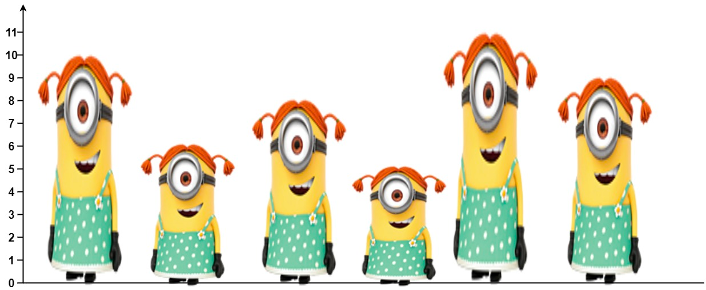

# [LeetCode] Number of Visible People in a Queue
## 문제 링크: https://leetcode.com/problems/number-of-visible-people-in-a-queue/

## 문제 설명 :

- 어레이 heights가 주어진다. 여기서 heights[i]는 i번째 사람의 키를 나타낸다. 
- 이 사람들은 왼쪽에서 오른쪽으로 0부터 n-1까지 번호가 매겨져 있으며, 키가 서로 다르다.
- 한 사람은 다른 사람을 볼 수 있다. i번째 사람은 i보다 큰 j번째 사람을 볼 수 있는데, 
- 이는 i < j이며, i번째와 j번째 사람 사이의 모든 사람의 키가 i번째 사람과 j번째 사람보다 작아야 한다. 
- 더 구체적으로는, min(heights[i], heights[j]) > max(heights[i+1], heights[i+2], ..., heights[j-1])이어야 한다.
- 길이 n의 배열 answer를 반환하는데, 여기서 answer[i]는 i번째 사람이 볼 수 있는 오른쪽에 있는 사람의 수이다.



## 문제 풀이
1. 모노토닉 증가 스택 사용
2. 왼쪽에서 부터 순회하면서, 스택에 원소 위치를 넣는다. (증가스택)
3. 만약 스택 윗부분의 위치로 찾은 heights의 원소가 현재 i번째 위치 원소보다 작거나 같으면, 스택 윗부분을 꺼낸 위치에 ++해줌
4. 3번의 경우가 아니라면 스택의 윗부분으로 보여지는 위치 result에 ++해줌
참고용 디버깅
```text
---------
2 : [1, 0, 0, 0, 0, 0]
---------
1 : [1, 1, 0, 0, 0, 0]
2 : [2, 1, 0, 0, 0, 0]
---------
2 : [2, 1, 1, 0, 0, 0]
---------
1 : [2, 1, 1, 1, 0, 0]
1 : [2, 1, 2, 1, 0, 0]
1 : [3, 1, 2, 1, 0, 0]
---------
2 : [3, 1, 2, 1, 1, 0]
```

```java
class Solution {
    public int[] canSeePersonsCount(int[] heights) {
        int[] result = new int[heights.length];

        Stack<Integer> stack = new Stack();
        for(int i = 0; i < heights.length; i++) {
            while (!stack.isEmpty() && heights[stack.peek()] <= heights[i]) {
                result[stack.pop()]++;
                System.out.println("1 : " + Arrays.toString(res));
            }
            if (!stack.isEmpty()) {
                res[stack.peek()]++;
                System.out.println("2 : " + Arrays.toString(res));
            }
            stack.add(i);
        }
        return result;
    }
}
```
```text
runtime : 62ms
beats : 19.62%
memory : 59.12mb
beats : 34.16%
```