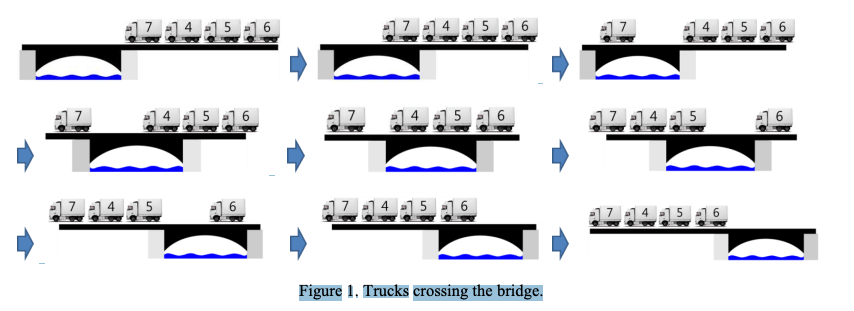
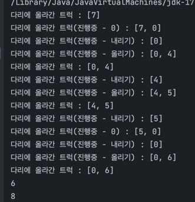

# [프로그래머스] 다리를 지나는 트럭

## 문제 링크: https://school.programmers.co.kr/learn/courses/30/lessons/42583#

</br>

## 문제 설명:

- 트럭 여러 대가 강을 가로지르는 일차선 다리를 정해진 순으로 건너려 합니다.
- 모든 트럭이 다리를 건너려면 최소 몇 초가 걸리는지 알아내야 합니다.
- 다리에는 트럭이 최대 bridge_length대 올라갈 수 있으며, 다리는 weight 이하까지의 무게를 견딜 수 있습니다.
- 단, 다리에 완전히 오르지 않은 트럭의 무게는 무시합니다.

- 예를 들어, 트럭 2대가 올라갈 수 있고 무게를 10kg까지 견디는 다리가 있습니다.
- 무게가 [7, 4, 5, 6]kg인 트럭이 순서대로 최단 시간 안에 다리를 건너려면 다음과 같이 건너야 합니다.

| 경과 시간 | 다리를 지난 트럭    | 다리를 건너는 트럭 | 대기 트럭        |
|-------|--------------|------------|--------------|
| 0     | []           | []         | [7, 4, 5, 6] |
| 1~2   | []           | [7]        | [4, 5, 6]    |
| 3     | [7]          | [4]        | [5, 6]       |
| 4     | [7]          | [4, 5]     | [6]          |
| 5     | [7, 4]       | [5]        | [6]          |
| 6~7   | [7, 4, 5]    | [6]        | []           |
| 8     | [7, 4, 5, 6] | []         | []           |

-
- 따라서, 모든 트럭이 다리를 지나려면 최소 8초가 걸립니다.
- solution 함수의 매개변수로 다리에 올라갈 수 있는 트럭 수 bridge_length, 다리가 견딜 수 있는 무게 weight, 트럭 별 무게 truck_weights가 주어집니다.
- 이때 모든 트럭이 다리를 건너려면 최소 몇 초가 걸리는지 return 하도록 solution 함수를 완성하세요.

## 문제 풀이
1. 선입선출을 위해 Queue사용, Queue의 목적은 다리를 건너는 중인 트럭들을 표시한다.
2. 대기중인 트럭들 (입력받은 int[] truck_weights)를 하나씩 순회하면서 다리에 올린다.
3. 다리에 올릴때 최대 무게를 넘지 않게 하기 위해 totalWeight에 해당 트럭 무게를 추가한다.
4. 다리 길이 한칸당 1초씩 들어간다
5. 트럭에 이미 최대로 올릴수 있는 길이/무게 일 경우 빼주면서 totalWeight에 무게도 빼준다.
6. 다리의 길이는 bridge_length이므로 움직일때마다 초 시간이 더해져야 한다.

8. 디버깅한 사진

```java
import java.util.*;

class Solution {
    public int solution(int bridge_length, int weight, int[] truck_weights) {
        int seconds = 0, totalWeight = 0;
        Queue<Integer> onBridge = new LinkedList<>();
        for (int i = 0; i < truck_weights.length; i++) {
            int targetTruck = truck_weights[i];
            if (onBridge.isEmpty()) {
                onBridge.offer(targetTruck);
                seconds++;
                totalWeight += targetTruck;
                // 다리에 트럭이 1개라도 있을 때
            } else {
                while (true) {
                    // 다리에 트럭이 2개일때
                    if (onBridge.size() == bridge_length) {
                        totalWeight -= onBridge.poll();
                        // 다리에 트럭이 1개일때
                    } else {
                        if (totalWeight + targetTruck <= weight) {
                            onBridge.offer(targetTruck);
                            seconds++;
                            totalWeight += targetTruck;
                            break;
                        } else {
                            onBridge.offer(0);
                            seconds++;
                        }
                    }
                }
            }
        }
        return seconds + bridge_length;
    }
}
```
```text
정확성  테스트
테스트 1 〉	통과 (0.90ms, 79.8MB)
테스트 2 〉	통과 (9.68ms, 78MB)
테스트 3 〉	통과 (0.11ms, 72.6MB)
테스트 4 〉	통과 (7.71ms, 72.7MB)
테스트 5 〉	통과 (23.49ms, 91MB)
테스트 6 〉	통과 (14.18ms, 78.6MB)
테스트 7 〉	통과 (1.18ms, 76.9MB)
테스트 8 〉	통과 (0.96ms, 73.3MB)
테스트 9 〉	통과 (2.53ms, 76.8MB)
테스트 10 〉	통과 (0.78ms, 73.1MB)
테스트 11 〉	통과 (0.18ms, 78.1MB)
테스트 12 〉	통과 (0.68ms, 72.9MB)
테스트 13 〉	통과 (1.68ms, 78.6MB)
```
## 다른 풀이
```java
import java.util.LinkedList;
import java.util.Queue;

public class Solution2 {
    static class Truck {
        int weight; // 트럭의 무게
        int entryTime; // 진입 시간

        Truck(int weight, int entryTime) {
            this.weight = weight;
            this.entryTime = entryTime;
        }
    }

    public int solution(int bridge_length, int weight, int[] truck_weights) {
        int seconds = 0;                  // 총 걸린 시간
        int currentWeight = 0;            // 현재 다리 위의 총 무게
        Queue<Truck> onBridge = new LinkedList<>();  // 다리 위의 트럭을 관리하는 큐

        int i = 0;  // 트럭 배열에서 처리 중인 인덱스
        while (i < truck_weights.length || !onBridge.isEmpty()) {
            seconds++;

            // 다리에 트럭이 올라갈 수 있는 경우 처리
            // 현재 다리의 트럭들 무게와 새로운 트럭의 무게를 더한 값이 다리가 견딜 수 있는 무게보다 작거나 같으면
            // 새로운 트럭은 Truck객체로 생성되서 onBridge 큐에 추가되고, 현재 다리에 있는 총 무게에 추가됨
            if (i < truck_weights.length && currentWeight + truck_weights[i] <= weight) {
                onBridge.offer(new Truck(truck_weights[i], seconds));
                currentWeight += truck_weights[i];
                i++;
            }
            // 다리를 나가는 트럭 처리
            // 큐 맨 앞에 있는 트럭이 다리를 나가는 시간이 다리의 길이와 같아지면 큐에서 제거,
            /// 해당 트럭의 무게를 현재 다리 위의 총 무게에서 빼줌
            if (!onBridge.isEmpty() && seconds - onBridge.peek().entryTime == bridge_length) {
                currentWeight -= onBridge.poll().weight;
            }
        }

        return seconds;
    }
}
```